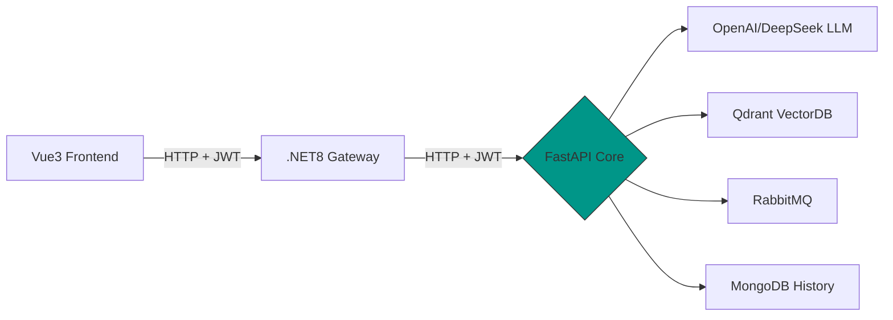

# RAG Intelligent Q&A System

[](https://github.com/yourname/rag-system/actions)
[](https://hub.docker.com/r/yourname/rag-api)
[](LICENSE)

An enterprise-grade RAG solution integrating multimodal AI, supporting cross-service collaboration and real-time data stream processing.

## 🌟 Core Features

- **Hybrid LLM Integration**: OpenAI GPT + DeepSeek combined reasoning
- **Vector Retrieval**: Qdrant efficient similarity search
- **Real-time Interaction**: SSE streaming response (Server-Sent Events)
- **Asynchronous Tasks**: RabbitMQ outbox for cross-microservice coordination
- **History Management**: MongoDB conversation storage and auditing
- **Security Authentication**: JWT cross-level authentication chain (Vue3 → .NET → FastAPI)
- **Containerization**: Docker deployment
- **Automation**: GitHub Actions CI/CD pipeline

## 🛠 Technical Architecture



## Tech Stack

- **Framework**: FastAPI
- **Database**: MongoDb
- **Asynchronous**: Yes
- **Authentication**: JWT
- **Documentation**: Swagger UI


### Prerequisites

- python:3.11 +
- pip

### Installing Dependencies

```bash
python -m venv myenv

myenv\Scripts\activate

pip install -r requirements.txt

deactivate
```

# Starting Infrastructure

* docker run -d -p 6333:6333 qdrant/qdrant
* docker run -d -p 5672:5672 rabbitmq:3.12-management
* docker run -d -p 27017:27017 mongo:7.0

## Quick Start

1. Install dependencies
2. Set up environment file
3. Start infrastructure
4. Run command:
   ```
   python main.py
   ```


