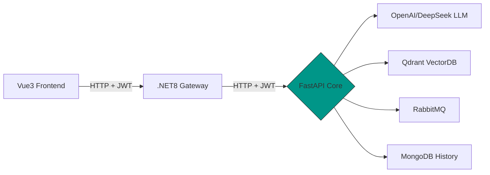

## py_chat_service

# RAG 智能問答系統

[](https://github.com/yourname/rag-system/actions)
[](https://hub.docker.com/r/yourname/rag-api)
[](LICENSE)

集成多模態 AI 的企業級 RAG 解決方案，支持跨服務協同與即時數據流處理。

## 🌟 核心功能

- **混合 LLM 集成**：OpenAI GPT + DeepSeek 聯合推理
- **向量檢索**：Qdrant 高效相似度搜索
- **即時交互**：SSE 流式響應 (Server-Sent Events)
- **異步任務**：RabbitMQ outbox 跨微服務協調
- **歷史管理**：MongoDB 對話存儲與審計
- **安全認證**：JWT 跨層級驗證鏈 (Vue3 → .NET → FastAPI)
- **容器化**：Docker 部署
- **自動化**：GitHub Actions CI/CD 流水線

## 🛠 技術架構



## 技術棧

- **框架**: FastAPI
- **數據庫**: MongoDb
- **異步支持**: Yes
- **認證**: JWT
- **文檔**: Swagger UI

### 前置需求

- python:3.11 +
- pip

### 安裝依賴

```bash
python -m venv myenv

myenv\Scripts\activate

pip install -r requirements.txt

deactivate
```

# 啟動基礎設施

* docker run -d -p 6333:6333 qdrant/qdrant
* docker run -d -p 5672:5672 rabbitmq:3.12-management
* docker run -d -p 27017:27017 mongo:7.0

## 快速開始

1. 安裝依賴
2. 設定 env 檔案
3. 啟動基礎設施
4. 執行指令
   ```
   python main.py
   ```
